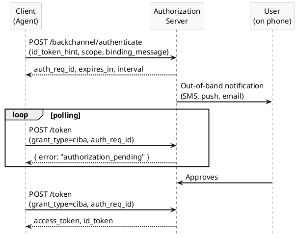
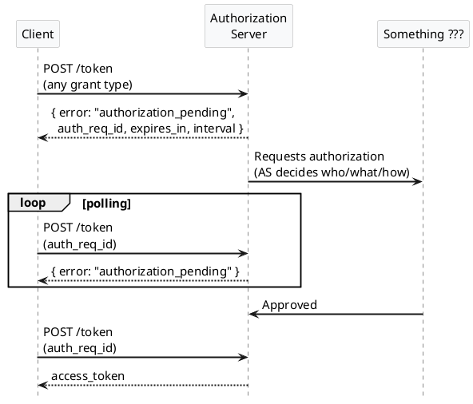
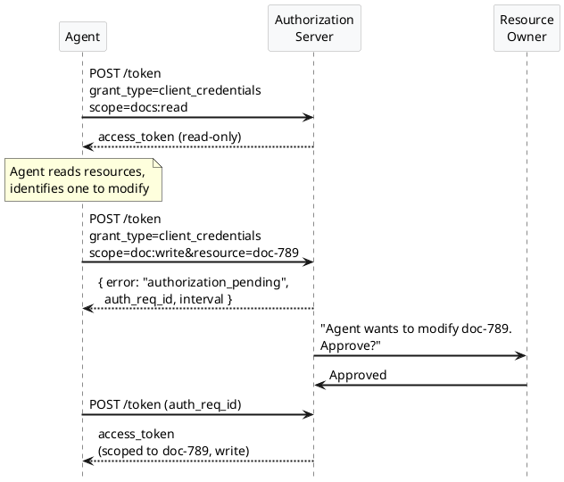
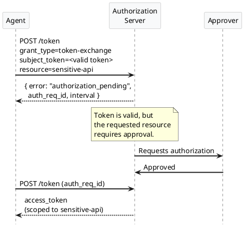
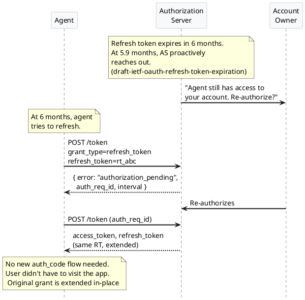

<style scoped>
  section {
    place-content: center center;
  }
</style>

# From CIBA to Deferred Token Response

## Max Gerber 

### May 2026

---

<style scoped>
  section {
    place-content: center center;
  }
</style>

# Why HITL Matters

---

## Agents need a human in the loop

Agents operate autonomously. But some actions are too high-risk to let an agent execute without a human confirming.

- **Irreversible**: deleting an account, sending a wire transfer
- **Expensive**: provisioning infrastructure, purchasing inventory
- **Sensitive**: sharing a document, modifying permissions
- **Regulated**: compliance-gated transactions, financial approvals

Re-engaging the human prior to execution is table-stakes for agent auth.

---

## Modeling HITL

HITL approval can be managed in two ways:
1. The Agent Harness is responsible
2. The Domain being accessed is responsible

---

## Agent Harness Managed

```excalidraw
@file:diagrams/agent-harness.excalidraw
```
---

## Agent Harness Managed

Agent Harness intercepts tool calls and determines if human confirmation is needed.
Examples: Claude Code / **A2H**

Pros:
- Native experience built into Agent UX
- Agent Harness understands intent across many domains

Cons:
- Can Harness be trusted to do HITL correctly?
- How is HITL "proven" to the Domain being acted on?
- How does logging / audit work?

---

## Domain Harness

```excalidraw
@file:diagrams/domain-harness.excalidraw
```

---

## Domain Harness Managed

Resource Server issues `WWW-Authenticate` challenge. Client replays challenge to Auth Server. Auth Server contacts user. 

Pros:
- HITL approval cryptographically embedded via Access Token
- AS in change of logging / audit responsibilities

Cons:
- Approval workflow is Domain-specific

---

We are primarily interested in **Domain Harness Managed HITL**

- Increasing usefulness of Access Tokens is good
- Consolidating decision-making within the AS is good
- Building on top of OAuth ecosystem is good

---

<style scoped>
  section {
    place-content: center center;
  }
</style>

# CIBA as a Solution for HITL

---

## CIBA is often floated as the answer

OpenID Connect Client-Initiated Backchannel Authentication checks many boxes:

1. **AS owns the notification** of the user (out-of-band channel: SMS, push, email)
2. **Client waits around** for the result and retries later (polling)
3. **Newly issued access token** contains verified proof of HITL from the AS

---

**CIBA flow**



<style scoped>
  section {
    place-content: center center;
  }
</style>

---

## CIBA back half is great

The parts that work well for HITL:

- **AS decides how to reach the user.** The client doesn't need to know the channel.
- **Polling is simple.** Client just retries on an interval.
- **Token is proof.** The issued token carries evidence that a human approved.
- **AS can take its time.** No browser session to keep alive.

This is exactly what we want. But...

---


## Problem 1: __Client__ Initiated

The **client** decides when CIBA is required. The server has **no way to signal it**.

There's no mechanism for the AS to say, in response to a normal token request:

> "Actually, I need human approval before I can issue this token. You need to wait a minute."

The client must know in advance that CIBA is the right thing to do, and once CIBA is initiated the user must be contacted.

What if the server wants to decide *when* HITL is required dynamically, based on **risk**, **policy**, or **context**?

---

## Problem 2: Backchannel __Authentication__

CIBA is an **OIDC** extension, not an OAuth extension. It's optimized for *authenticating* a user, not *requesting authorization* to a resource.

The client must tell the AS **who** to send the notification to:

- `id_token_hint` (a previously issued ID token)
- `login_hint` (an email, phone number, etc.)
- `login_hint_token`

The **server** cannot choose who to route the approval based on the request context.

---

## What if the client doesn't know who the approver is?

With CIBA, the client must already know who that owner is and have an identifier for them. But often:

- The client **doesn't know who owns the resource**
- The approval might **route to a system (ServiceNow, Okta Engine)**, not a person
- The approver **might not be the resource owner** (delegated approval)
- **Multiple humans** might need to approve

CIBA can't model any of this.

---

<style scoped>
  section {
    place-content: center center;
  }
</style>

# What We Actually Want

---

**Ideal flow**


<style scoped>
  section {
    place-content: center center;
  }
</style>



---

## Key differences from CIBA

|                             | CIBA            | What we want |
|-----------------------------|-----------------|--------------|
| Who decides HITL is needed? | Client          | Server       |
| Who initiates?              | Client          | Server       |
| Who picks the approver?     | Client          | Server       |
| Which grant types?          | CIBA grant only | Any          |

---

<style scoped>
  section {
    place-content: center center;
  }
</style>

## We could call this...

# Server Initiated Backchannel Authorization

# (SIBA)

---
<style scoped>
  section {
    place-content: center center;
  }
</style>

## just kidding...

---
<style scoped>
  section {
    place-content: center center;
  }
</style>

# Deferred Token Response

---

## AS reaches out to "something"

That "something" is not constrained to be a single user that the client names. This unlocks:

```d2
direction: right

as: Authorization Server {style.fill: "#b2f2bb"}

owner: Resource Owner {style.fill: "#a5d8ff"}
system: Approval System\n(ServiceNow, Okta) {style.fill: "#ffd8a8"}
chain: Delegation Chain\n(manager approves\nfor OOO IC) {style.fill: "#ffb3b3"}

client -> as

as -> owner: route to resource owner\n(client doesn't need to know who)
as -> system: route to external systems
as -> chain: multi-human or\ndelegated approvals
```

---

## Concrete flexibility

- **Route to resource owner:** Client wants to modify a document. AS knows who owns it. Client doesn't need to.
- **Route to systems:** Approval goes to a ServiceNow ticket, Jira workflow, or Slack channel.
- **Delegated approval:** IC is on vacation. Their manager can approve on their behalf.
- **Multi-party:** Two of three admins must approve before the token is issued.

None of this is possible when the client picks the approver.

---

## Fighting Consent Fatigue

Some CIBA implementations pepper the end user with individual approvals - one per unique request.

This leads to consent fatigue and increases the risk of a user approving a request they shouldn't.

CIBA is optimized for short-lived interactions notifying a specific user. By breaking this model we unlock:
- Batch approval workflows combining requests from many resources & clients 
- Routing requests to users in a better position to evaluate them (IT Admins, Security professionals)
- Programmatic approval or denial of requests based on standing policy

---

## Batch Approval workflows

```d2
direction: right

as: Authorization Server {style.fill: "#b2f2bb"}

c1: Client 1 {style.fill: "#a5d8ff"}
c2: Client 2 {style.fill: "#ffd8a8"}
c3: Client 3 {style.fill: "#e9ecef"}

c1 -> as: Resource A
c1 -> as: Resource B
c1 -> as: Resource C
c2 -> as: Resource D
c2 -> as: Resource E
c3 -> as: Resource F
c3 -> as: Resource G

as -> user: One Batch Notification
user -> as: Bulk approve/deny
```

---

<style scoped>
  section {
    place-content: center center;
  }
</style>

# Examples

---

**Example: Client Credentials**


<style scoped>
  section {
    place-content: center center;
  }
</style>



---
<style scoped>
  section {
    place-content: center center;
  }
</style>

**Example: Token Exchange**



---

<style scoped>
  section {
    place-content: center center;
  }
</style>

# Beyond Agentic HITL

---

<style scoped>
  section {
    place-content: center center;
  }
</style>


**Example: Refresh Token**



---

## Banking already needs this

We care about HITL for agents, but it turns out this pattern is generally useful. 
Some banking patterns require deferral for auth_code flows today.

---

## Use Case: High-Risk Transaction Evaluation

A user initiates a high-risk transaction at their bank. 
The OP notices unusual behavior and decides to defer until further verification is complete.

Verification may involve:

- Contacting the user through alternative channels
- Manual review by a fraud analyst
- Additional security checks

The user does not need to remain in the banking application. 
Transaction processing continues in the background as soon as a decision is made.

This can take minutes to hours.

---

## Use Case: ID Verification from Physical Evidence

Many jurisdictions lack widespread digital identity. Identity verification relies on scanning physical documents (passport, driver's license) plus a liveness check.

Usually automated systems handle this. Sometimes a human operator must manually verify. This takes a long time and may involve contacting the user via another channel.

The RP can continue with steps that don't require completed verification, and notify the user when the final decision lands. Compliant with regulation on automated decision-making.

---

## Prior art

Already an OIDF draft: **`openid-deferred-token-response-1_0`**.

It introduces `response_type=deferred_code` for `auth_code` flows that need arbitrary time to complete.

We're generalizing this: not just a new response type, but a pattern that applies to any `/token` response.

Significant overlap with **`draft-parecki-oauth-jwt-grant-interaction-response`** as well.

---

## Parallel Workstreams

DTR describes _how the AS notifies the Client_ during an approval workflow.

There is no standard for cases where the AS wants to route the approval to a separate system (ServiceNow, Okta Engine).

`draft-mcguinness-authzen-access-request-latest` in AuthZen WG seeks to address this gap. 

This draft describes a common standard for requesting access from a workflow engine. 

---

## Next Steps

- Work with OIDF authors to split the OIDF draft into 2
  - Core IETF draft 
  - OIDF profile that only incudes OIDF concerns
- Publish as an Individual Draft 
- Get on the agenda for IETF 126
